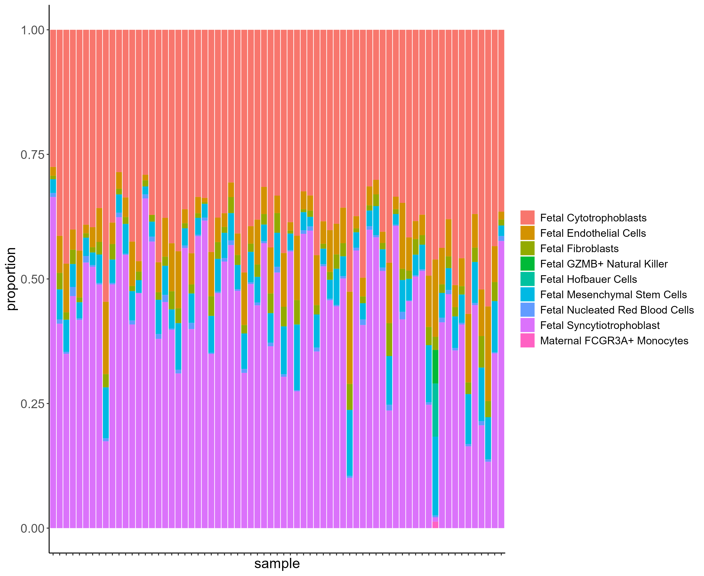

# Placenta Cell Type Deconvolution Example

This document demonstrates how to use our single cell RNA-sequencing
reference panel from [Campbell et
al. 2023](https://www.nature.com/articles/s42003-023-04623-6) with the
[MuSiC package](https://xuranw.github.io/MuSiC/index.html) in R to
deconvolute cell type proportions from bulk placenta tissue
RNA-sequencing data. Code for use of the CIBERSORTx software to
deconvolute as described in the Campbell paper is also available on
[GitHub](https://github.com/bakulskilab/Placental-cell-type-deconvolution-reveals-that-cell-proportions-drive-preeclampsia-gene-expression/blob/main/scripts/cibersortx/cibersortx_docker_code.txt).
Some users have expressed difficulty using the CIBERSORTx software, and
this document provides an alternative in R.

To deconvolute placental tissue RNA data, you will need:

1.  Placental single cell reference data with marker genes for each of
    the cell types. The placenta single cell reference Seurat object
    developed in the Campbell paper can be downloaded from the
    associated GEO [accession
    GSE182381](https://www.ncbi.nlm.nih.gov/geo/query/acc.cgi?acc=GSE182381).

2.  A bulk tissue placental RNA-sequencing dataset that you would like
    to deconvolute. The example bulk placenta dataset used for
    demonstration in this document was download from GEO [accession
    GSE253158](https://www.ncbi.nlm.nih.gov/geo/query/acc.cgi?acc=GSE253158).
    You can substitute your own bulk tissue dataset of interest.

3.  A deconvolution R package. Here we use MuSiC.

``` r
library(MuSiC)
library(Seurat)
library(SingleCellExperiment)
library(data.table)
```

MuSiC takes the input bulk data as a matrix of raw counts of RNA
expression. The row names of the matrix are genes that should match up
with gene identifiers in the single cell reference. Column names are the
sample names.

``` r
# load bulk dataset
bulk_dataset <- fread("GSE253158_raw_counts_GRCh38.p13_NCBI.tsv")

# convert gene ids to gene symbols
annot <- fread("Human.GRCh38.p13.annot.tsv")
bulk_dataset$GeneID <- annot[match(bulk_dataset$GeneID,annot$GeneID),]$Symbol

# one duplicated gene, very low/no expression, so remove since matrix can't have duplicated row names
bulk_dataset <- bulk_dataset[bulk_dataset$GeneID != 'TRNAV-CAC',] 

# make into matrix format
temp <- bulk_dataset$GeneID
bulk_dataset <- as.matrix(bulk_dataset[,-1])
rownames(bulk_dataset) <- temp
```

MuSiC takes the single cell reference input as a SingleCellExperiment
object, which we can create from the Seurat object provided.

``` r
# load single cell reference
scref <- readRDS("GSE182381_processed_single_cell_Seurat_object.rda")

# construct singlecellexperiment object for use in music function
ref <- SingleCellExperiment(
  list(counts=scref[["RNA"]]$counts), #grab count data
  colData=scref[[]] #grab meta data
)
```

Use prepared input with MuSiC to get cell proportion estimates:

``` r
# use music to get cell proportion estimates
est <- music_prop(bulk.mtx = bulk_dataset,
                  sc.sce = ref,
                  clusters = 'cell.type',
                  samples = 'ident')
```

    Creating Relative Abudance Matrix...

    Creating Variance Matrix...

    Creating Library Size Matrix...

    Used 18199 common genes...

    Used 26 cell types in deconvolution...

    GSM8015331 has common genes 17105 ...

    GSM8015332 has common genes 17300 ...

    GSM8015333 has common genes 17271 ...

    GSM8015334 has common genes 17102 ...

    GSM8015335 has common genes 17860 ...

    GSM8015336 has common genes 16907 ...

    GSM8015337 has common genes 17022 ...

    GSM8015338 has common genes 16996 ...

    GSM8015339 has common genes 17289 ...

    GSM8015340 has common genes 17170 ...

    GSM8015341 has common genes 17080 ...

    GSM8015343 has common genes 17166 ...

    GSM8015344 has common genes 17080 ...

    GSM8015345 has common genes 17004 ...

    GSM8015346 has common genes 17053 ...

    GSM8015347 has common genes 17039 ...

    GSM8015348 has common genes 17291 ...

    GSM8015349 has common genes 17231 ...

    GSM8015351 has common genes 17446 ...

    GSM8015352 has common genes 17877 ...

    GSM8015353 has common genes 17113 ...

    GSM8015354 has common genes 17235 ...

    GSM8015355 has common genes 16814 ...

    GSM8015357 has common genes 17237 ...

    GSM8015358 has common genes 17296 ...

    GSM8015359 has common genes 17188 ...

    GSM8015360 has common genes 17051 ...

    GSM8015361 has common genes 17138 ...

    GSM8015362 has common genes 16873 ...

    GSM8015363 has common genes 17369 ...

    GSM8015364 has common genes 17231 ...

    GSM8015365 has common genes 17173 ...

    GSM8015366 has common genes 17018 ...

    GSM8015368 has common genes 17292 ...

    GSM8015369 has common genes 17223 ...

    GSM8015370 has common genes 17203 ...

    GSM8015372 has common genes 16999 ...

    GSM8015373 has common genes 17452 ...

    GSM8015374 has common genes 17040 ...

    GSM8015375 has common genes 17023 ...

    GSM8015376 has common genes 17233 ...

    GSM8015377 has common genes 17049 ...

    GSM8015378 has common genes 16975 ...

    GSM8015379 has common genes 17251 ...

    GSM8015380 has common genes 17069 ...

    GSM8015381 has common genes 18098 ...

    GSM8015382 has common genes 16906 ...

    GSM8015383 has common genes 17163 ...

    GSM8015384 has common genes 16951 ...

    GSM8015385 has common genes 17139 ...

    GSM8015386 has common genes 16999 ...

    GSM8015387 has common genes 17360 ...

    GSM8015390 has common genes 17007 ...

    GSM8015391 has common genes 17040 ...

    GSM8015392 has common genes 18161 ...

    GSM8015393 has common genes 17130 ...

    GSM8015394 has common genes 17058 ...

    GSM8015395 has common genes 17278 ...

    GSM8015396 has common genes 17871 ...

    GSM8015397 has common genes 17155 ...

    GSM8015398 has common genes 16904 ...

    GSM8015399 has common genes 17066 ...

    GSM8015400 has common genes 17065 ...

    GSM8015402 has common genes 17308 ...

    GSM8015403 has common genes 17252 ...

    GSM8015404 has common genes 17506 ...

    GSM8015405 has common genes 17879 ...

    GSM8015407 has common genes 17257 ...

    GSM8015409 has common genes 16828 ...

Here we plot the estimated cell proportions. For sake of clarity in the
plot, cell types with zero proportion estimated across all samples are
removed.

``` r
# load packages 
library(ggplot2)
library(tidyr)
library(dplyr)
library(gt)

# converting cell proportion estimates to long for plotting 
# (note: you probably would prefer wide format for use in analysis)
cell.prop <- est$Est.prop.weighted 
temp.names <- colnames(cell.prop)
cell.prop <- data.frame(cell.prop)
colnames(cell.prop) <- temp.names
cell.prop$ID <- rownames(cell.prop)
cell.prop <- pivot_longer(cell.prop, 
                          cols = !ID,
                          names_to="cell.type",
                          values_to="proportion")

# summary table of estimates
cell.prop %>% group_by(cell.type) %>%
  summarize("Mean Percent"=(mean(proportion)*100) %>% round(2)) %>%
  gt()
```

<div id="ddztjzrfen" style="padding-left:0px;padding-right:0px;padding-top:10px;padding-bottom:10px;overflow-x:auto;overflow-y:auto;width:auto;height:auto;">
<table class="gt_table" data-quarto-disable-processing="false" data-quarto-bootstrap="false">
  <thead>
    <tr class="gt_col_headings">
      <th class="gt_col_heading gt_columns_bottom_border gt_left" rowspan="1" colspan="1" scope="col" id="cell.type">cell.type</th>
      <th class="gt_col_heading gt_columns_bottom_border gt_right" rowspan="1" colspan="1" scope="col" id="Mean Percent">Mean Percent</th>
    </tr>
  </thead>
  <tbody class="gt_table_body">
    <tr><td headers="cell.type" class="gt_row gt_left">Fetal B Cells</td>
<td headers="Mean Percent" class="gt_row gt_right">0.00</td></tr>
    <tr><td headers="cell.type" class="gt_row gt_left">Fetal CD14+ Monocytes</td>
<td headers="Mean Percent" class="gt_row gt_right">0.00</td></tr>
    <tr><td headers="cell.type" class="gt_row gt_left">Fetal CD8+ Cytotoxic T Cells</td>
<td headers="Mean Percent" class="gt_row gt_right">0.00</td></tr>
    <tr><td headers="cell.type" class="gt_row gt_left">Fetal Cytotrophoblasts</td>
<td headers="Mean Percent" class="gt_row gt_right">40.42</td></tr>
    <tr><td headers="cell.type" class="gt_row gt_left">Fetal Endothelial Cells</td>
<td headers="Mean Percent" class="gt_row gt_right">6.50</td></tr>
    <tr><td headers="cell.type" class="gt_row gt_left">Fetal Fibroblasts</td>
<td headers="Mean Percent" class="gt_row gt_right">2.23</td></tr>
    <tr><td headers="cell.type" class="gt_row gt_left">Fetal GZMB+ Natural Killer</td>
<td headers="Mean Percent" class="gt_row gt_right">0.10</td></tr>
    <tr><td headers="cell.type" class="gt_row gt_left">Fetal GZMK+ Natural Killer</td>
<td headers="Mean Percent" class="gt_row gt_right">0.00</td></tr>
    <tr><td headers="cell.type" class="gt_row gt_left">Fetal Hofbauer Cells</td>
<td headers="Mean Percent" class="gt_row gt_right">0.16</td></tr>
    <tr><td headers="cell.type" class="gt_row gt_left">Fetal Memory CD4+ T Cells</td>
<td headers="Mean Percent" class="gt_row gt_right">0.00</td></tr>
    <tr><td headers="cell.type" class="gt_row gt_left">Fetal Mesenchymal Stem Cells</td>
<td headers="Mean Percent" class="gt_row gt_right">5.75</td></tr>
    <tr><td headers="cell.type" class="gt_row gt_left">Fetal Naive CD4+ T Cells</td>
<td headers="Mean Percent" class="gt_row gt_right">0.00</td></tr>
    <tr><td headers="cell.type" class="gt_row gt_left">Fetal Naive CD8+ T Cells</td>
<td headers="Mean Percent" class="gt_row gt_right">0.00</td></tr>
    <tr><td headers="cell.type" class="gt_row gt_left">Fetal Natural Killer T Cells</td>
<td headers="Mean Percent" class="gt_row gt_right">0.00</td></tr>
    <tr><td headers="cell.type" class="gt_row gt_left">Fetal Nucleated Red Blood Cells</td>
<td headers="Mean Percent" class="gt_row gt_right">0.62</td></tr>
    <tr><td headers="cell.type" class="gt_row gt_left">Fetal Plasmacytoid Dendritic Cells</td>
<td headers="Mean Percent" class="gt_row gt_right">0.00</td></tr>
    <tr><td headers="cell.type" class="gt_row gt_left">Fetal Proliferative Cytotrophoblasts</td>
<td headers="Mean Percent" class="gt_row gt_right">0.00</td></tr>
    <tr><td headers="cell.type" class="gt_row gt_left">Fetal Syncytiotrophoblast</td>
<td headers="Mean Percent" class="gt_row gt_right">44.20</td></tr>
    <tr><td headers="cell.type" class="gt_row gt_left">Maternal B Cells</td>
<td headers="Mean Percent" class="gt_row gt_right">0.00</td></tr>
    <tr><td headers="cell.type" class="gt_row gt_left">Maternal CD14+ Monocytes</td>
<td headers="Mean Percent" class="gt_row gt_right">0.00</td></tr>
    <tr><td headers="cell.type" class="gt_row gt_left">Maternal CD8+ Cytotoxic T Cells</td>
<td headers="Mean Percent" class="gt_row gt_right">0.00</td></tr>
    <tr><td headers="cell.type" class="gt_row gt_left">Maternal FCGR3A+ Monocytes</td>
<td headers="Mean Percent" class="gt_row gt_right">0.02</td></tr>
    <tr><td headers="cell.type" class="gt_row gt_left">Maternal Naive CD4+ T Cells</td>
<td headers="Mean Percent" class="gt_row gt_right">0.00</td></tr>
    <tr><td headers="cell.type" class="gt_row gt_left">Maternal Naive CD8+ T Cells</td>
<td headers="Mean Percent" class="gt_row gt_right">0.00</td></tr>
    <tr><td headers="cell.type" class="gt_row gt_left">Maternal Natural Killer Cells</td>
<td headers="Mean Percent" class="gt_row gt_right">0.00</td></tr>
    <tr><td headers="cell.type" class="gt_row gt_left">Maternal Plasma Cells</td>
<td headers="Mean Percent" class="gt_row gt_right">0.00</td></tr>
  </tbody>
  &#10;  
</table>
</div>

``` r
# for sake of clearer legend, filter cell types with zero estimated in all samples
cell.prop <- cell.prop %>% group_by(cell.type) %>%
  filter(!mean(proportion)==0)

# stacked bar chart of cell proportions
ggplot(cell.prop, aes(x=ID, y=proportion, fill=cell.type)) +
  geom_bar(position="stack", stat='identity') +
  xlab('sample') +
  theme_classic() +
  theme(axis.text.x=element_blank(),
        legend.text=element_text(size=12),
        legend.title=element_blank(),
        axis.title=element_text(size=16),
        axis.text=element_text(size=14))
```


